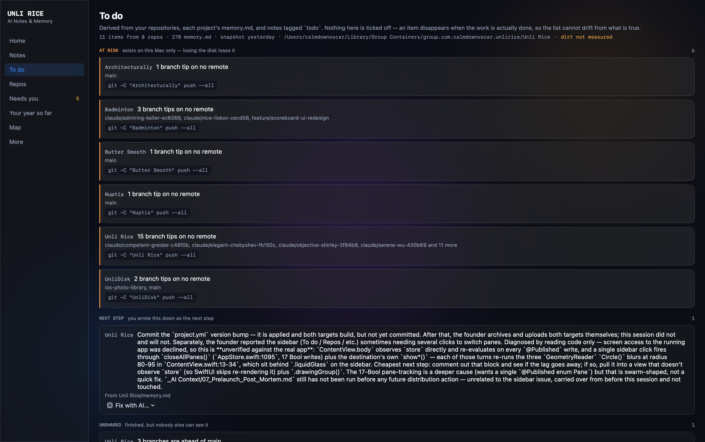
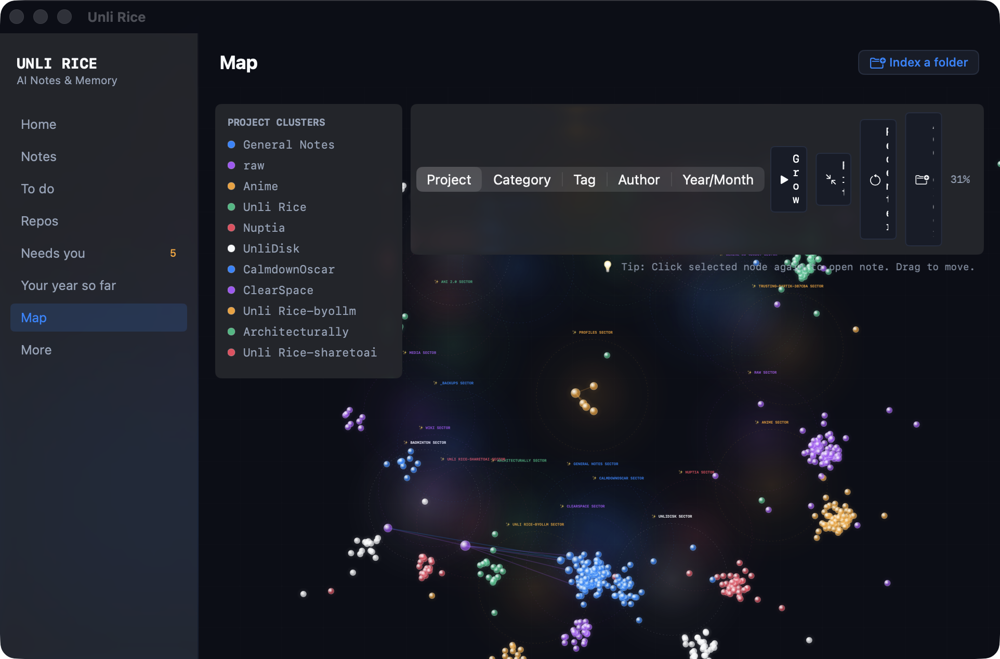

# Unli Rice

A persistent memory layer for autonomous LLM agents (Claude, Gemini, ChatGPT,
Kimi, coding assistants, local daemons), exposed over MCP. Multiple agents can
read and write into the same notes concurrently; every change is recorded as
an immutable event, and nothing is ever destructively deleted by an agent.

**[Read the User Guide](https://calmdownoscar.com/unlirice/user_guide.html)** — how to connect each AI tool (and how to paste the MCP config without breaking it), what can and cannot delete your notes, and what every pane actually does. It is audited against the code rather than written from memory.

See [PROJECT_NOTES.md](PROJECT_NOTES.md) for architecture, current status, and what's deferred — read that first before making changes.

Everything runs on-device, and the package has **no external dependencies** —
no bundled model, analytics, cloud service, or credentials. The optional
embedding connection is restricted to localhost. The reasoning that lives in
the system comes from whatever agent you connect over MCP.

## Documentation

- **[User Guide](https://calmdownoscar.com/unlirice/user_guide.html)** — the full guide, on the web: connecting each tool, pasting MCP config correctly, the three note layers, what can and cannot delete, troubleshooting, and a tool reference.
- **[Setup & User Guide](docs/USER_GUIDE.md)** — the in-repo version: step-by-step setup, connecting AI tools, Profile Builder, multi-vault profiles, and Mirror Export.
- **[Starter Templates](docs/TEMPLATES.md)** — Built-in Profile Builder templates and custom template format.
- **[Architecture & Project Notes](PROJECT_NOTES.md)** — Core design principles, append-only log architecture, and technical record.

## Screenshots

**To do.** Every item is derived from something real: a branch tip that is on no remote this machine has fetched, a `**Next step:**` line in a project's `memory.md`, or a note an agent tagged `todo`. Derived items have no checkbox — they disappear when the state that made them true does.



**Repos.** The branch graph. It compares each branch tip against the remote refs this clone has already fetched, and deliberately shows no ahead/behind counts: those need a walk over commit objects, and the App Sandbox forbids shelling out to `git` to do it.



More, including the iPhone capture app, in [`Screenshots/`](Screenshots/).

## Quick start

Download directly from the **[Mac App Store](https://apps.apple.com/app/unli-rice)**.

Alternatively, build a local app bundle:

```sh
./Scripts/make-app.sh         # builds dist/Unli Rice.app — then just open it
```

Or from source:

```sh
swift build
swift test

swift run unlirice-mcp        # the MCP stdio server
swift run UnliRiceApp         # the GUI
swift run unlirice-agent      # one unattended maintenance tick, then exits
swift run janitor-calibrate   # dry-run the janitor's thresholds, writes nothing
```

For a Mac App Store archive, run `xcodegen generate` and open
`UnliRice.xcodeproj`. See [APP_STORE_SUBMISSION.md](APP_STORE_SUBMISSION.md) for
the signing, privacy, metadata, and review checklist. `project.yml` is the
source of truth for the generated project.

## Running itself

The app is meant to be ignorable. The **Keep working with the window closed**
toggle registers its bundled LaunchAgent so ingestion and the janitor keep
running after the window closes; anything that needs a human decision waits in
the notification centre instead of interrupting, and **Your Review** reads a
month or a year back to you from notes you already have. Nothing that runs
unattended can do more than the buttons can — the janitor may only tag and flag,
ingest may only create and append, and there is no delete anywhere in the
codebase.

## How this got built

Vibecoded in about 6 hours using the pipeline described at
[calmdownoscar.com/apps](https://calmdownoscar.com/apps). Backend and systems
work isn't really my strong side — I'm more of a front-end vibe coder — so
rather than maintain something outside my lane long-term, it's open source.
Issues and PRs welcome.

## Privacy

Unli Rice is local-first and does not collect user data. See the
[Privacy Policy](PRIVACY.md).

## License

MIT — see [LICENSE](LICENSE).
